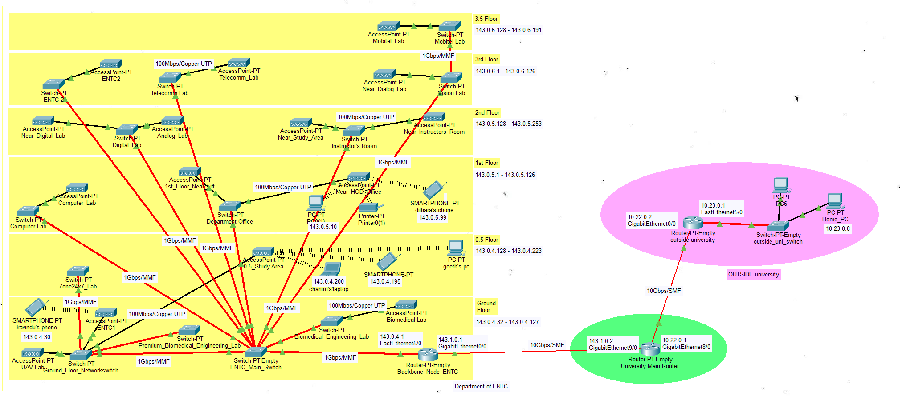
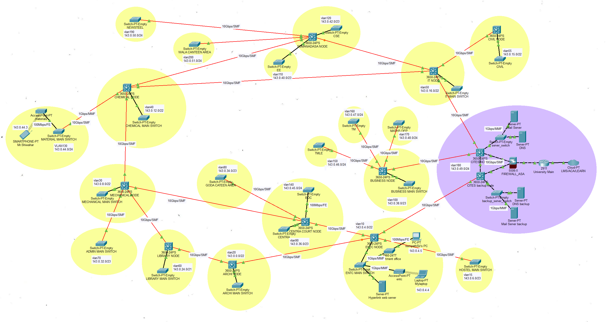

# UoM Core and Backbone Network Infrastructure Design

This project focuses on designing a scalable and cost-effective campus network for the **University of Moratuwa**, along with the internal **ENTC Local Area Network (LAN)**. The primary objective is to ensure reliable connectivity between university buildings while supporting future expansion, efficient resource utilization, and modern networking requirements.

  
  

The network design follows a **hybrid topology**, combining a **ring-based backbone with partial mesh connectivity** and **star-based LANs within buildings**. This approach improves reliability through redundancy, reduces cabling costs compared to full mesh designs, and allows easy scalability as new buildings or departments are added. Layer 3 switches are used for high-speed routing within the backbone, while VLAN-based segmentation is used to organize the network efficiently.

This repository includes the **Cisco Packet Tracer simulation files**, IPv4 and IPv6 addressing schemes, VLAN mappings, routing configurations, and basic network services such as DNS and web servers. The design is validated through simulation to ensure proper connectivity and functionality across the network.
